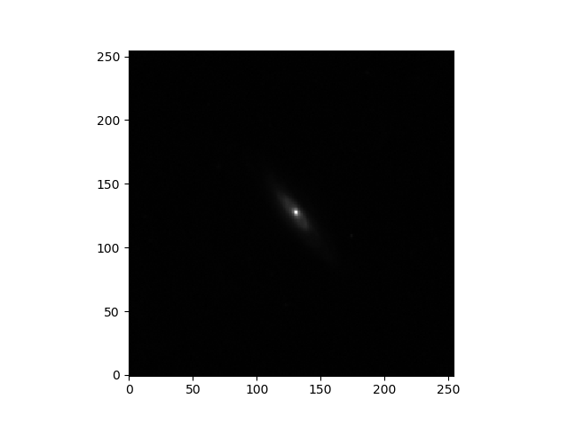

## Table of Contents
1. [Overview](#overview)
2. [Installation](#installation)
3. [Implementation](#implementation)
    - [lenser_galaxy](#lenser_galaxy)
    - [lenser_aim](#lenser_galaxy)
    


## Overview

Lenser is a powerful tool that finds the lensing parameters of galaxy images. The Lenser package uses two main files: lenser_galaxy and lenser_aim. The lenser_galaxy file can be used to clean an image of a galaxy by getting rid of background radiation, adjusting for noise, and masking out irrelevant data. These images can then be manipulated using the lenser-aim file which will predict how the galaxy looks without the presence of gravitational lensing and can produce the three shear parameters and four flexion parameters of the galaxy. This tool can be utilized for cosmological probing and dark matter mapping.

<figure>
    
    <figcaption><i>Galaxy FITS file plotted using Lenser</i></figcaption>
</figure>
    
## Installation
This package uses python 3, and you will need to have astropy, scipy, numpy, and matplotlib installed. These are standard with most python insallations.

## Implementation
1. [lenser_galaxy](#lenser_galaxy)
2. [lenser_aim](#lenser_aim)

### lenser_galaxy
lenser_galaxy consists of a Galaxy class, an Image class, and a Lens class. Using these classes you can preform many manipulations on a "postage stamp" of a galaxy including subtracting background radiation, estimating noise, and masking tangential radiation to only show relevant data. These three functions prepare the data to be inputted into [lenser_aim](#lenser_aim)
1. [Using the Galaxy class](#Galaxy)
    - [setName()](#setName())
    - [setPar()](#setPar())
    - [setLens()](#setLens())
    - [generateImage()](#generateImage())
    - [plot()](#plotGalaxy)
2. [Using the Image class](#Image)
    - [plot()](#plotImage)
    - [setMap()](#setMap())
    - [getMap()](#getMap())
3. [Using the Lens class](#Lens)
    - [deproject()](#deproject())
    - [setPsi2()](#setPsi2())
    - [setPsi3()](#setPsi3())

<a name="Galaxy"></a>
#### Using the Galaxy class
The galaxy object contains the set of paramaters relevant to lensing. Each parameter is given a default value, so no attributes are required at instantiation:

```python
mygalaxy = Galaxy(xc=0, yc=0, ns=0.5, rs=1.0, q=1.0, phi=0.0, galaxyLens=None)
```

This is the default galaxy object. xc and yc which are the dimensions of the "postage stamp," ns is the factor by which the intensity falls of, rs is the reduced Einstein radius or the radius at which the intensity has fallen off by one half, q is the ratio of the semimajor and semiminor axes of the galaxy, phi is the angle of rotation of the galaxy in radians, and galaxyLens is a [Lens object](#Lens) or None.

<a name="setName()"></a>
##### setName()
You can change the name of your galaxy object using the setName method.

```python
mygalaxy.setName(newname)
#your galaxy object will now have the new name of "newname"
```

<a name="setPar()"></a>
##### setPar()
You can change any of the parameters using the setPar function. This function takes two arguments: the new value and the value type.

```python
mygalaxy.setPar(val = newvalue, type = valuetype)
#mygalaxy will now have its valuetype parameter changed to whatever newvalue is
```

The acceptable values for the type argument are the first six attributes of the galaxy class: "xc", "yx", "ns", "rs", "q", "phi". Using one of these as the type argument will change that prospective attribute of your galaxy object to whatever the val argument is.
    
<a name="setLens()"></a>
##### setLens()
The setLens method can be used to change the Lens attribute of the Galaxyobject. 

```python
mygalaxy.setLens(newlens = myLens)
#mygalaxy.Lens is now equal to myLens
```

The newlens argument must be a [Lens object](#Lens).

<a name="generateImage()"></a>
##### generateImage()
The generateImage function is used to create an instance of the [Image class](#Image) based on your galaxy object.

```python
mygalaxy.generateImage(nx = value1, ny = value2, lens=False, noise1=0, noise2=0)
```

The nx and ny arguments are associated with the dimensions of the maps created by the [Image class](#Image). The lens attribute will apply the [deproject](#deproject) function to the galaxylens attribute of your galaxy object. Noise1 and noise2 will be used to generate the noise map attribute for the [Image class](#Image) object. The lens, noise1, and noise2 attributes are defaulted to False, 0, and 0 respectively. The nx and ny arguments must be inputted in order to use the function. 

<a name="plotGalaxy"></a>
##### plot()
This function uses the [generateImage](#generateIamge) function to create an [Image](#Image) object that is then displayed through a matplotlib window.

```python
mygalaxy.plot(nx = value1, ny = value2, lens = False)
```

The nx, ny, and lens arguments are inputted into the respective arguments for the [generateImage](#generateImage) function. See [generateImage](#generateImage) for a description of those attributes. The lens attribute is defaulted to False, but nx and ny are required.

<a name="Image"></a>
#### Using the Image class
The image class contains a seriese of maps as its main attributes: a map of the overall data, a map of the noise, and a map of the mask. Each attribute must be given at instantiation. 

```python
myimage = Image(name = "myimagename", datamap = mydata, noisemap = mynoisedata, maskmap = mymaskdata)
```

For the map attributes to be workable with other functions in Lenser, it is best that they are all 2D lists or numpy arrays of the same size.

<a name="plotImage"></a>
##### plot()
The plot function will plot information in an [Image object](#Image).

```python
myimage.plot(type = mymaptype)
```

The accepted values for the type argument are "data", "mask", and "noise". Using one of these arguments will plot the respective map and display it on a matplotlib window. The type argument is defaulted to 'data', so a plot function given without any arguments, `myimage.plot()`, will plot the datamap of the [Image object](#Image).

<a name="setMap()"></a>
##### setMap()
The setMap function can be used to change any of the three maps contained in the [Image object](#Image).

```python
myimage.setMap(newdata = mydata, type = mymaptype)
```

The acceptable values for the type argument are "data", "mask", and "noise". Using one of these will change that respective attribute into whatever is given in the newdata argument. 

<a name="getMap()"></a>
##### getMap()
The getMap function can be used to get any of the three maps contained in the [Image object](#Image).

```python
myimage.getMap(type = mymaptype)
```

The acceptable values for the type argument are "data", "mask", and "noise". Using one of these will return the respective attribute of your [Image object](#Image).

<a name="generateMask()"></a>
##### generateMask()
This function generates a mask based on the image data. This function then sets your image object's maskmap attribute to this newly generated mask.

```python
myimage.generateMask(subtractBackground=False)
```

The subtractBackground argument will subtract away the background radiation before the mask is generated. This argument is defaulted to False, so no arguments are needed when using this function. After using this function, your [Image object](#Image) will now have a map of ones and zeros as the maskmap attribute where ones correspond to relevant data.

<a name="Lens"></a>
#### Using the Lens class
The Lens class allows you to deproject your galaxy image to its unlensed plane and starts the path to finding accurate shear and flexion values. Each attribute in the Lens class is given a default, so no values are required when instantiating a Lens object.

```python
mylens = Lens(psi2=[0,0,0],psi3=[0,0,0,0])
```

The attributes, psi2 and psi3, represent the three parameters of shear and the four parameters of flexion corresponding to the second and third derivatives of the lensing potential. They are defaulted to the shown values.

<a name="deproject()"></a>
##### deproject()
The deprojeciton function applies a transform to a set of data that "deprojects" the data to before it was lensed.

```python
mylens.deproject(thetax = value1, thetay = value2)
```

The values for thetax and thetay can either be numbers or numpy arrays. The new values found after the transformation corresponding to thetax and thetay are then returned to the user.

<a name="setPsi2Lens"></a>
##### setPsi2()
The values for psi2 can be changed using the setPsi2 function.

```python
mylens.setPsi2(psi2new = mynewvalue)
#or
mylens.setPsi2(mynewvalue)
```

The psi2 attribute of mylens is now set to mynewvalue. This attribute should be a list or array of length three.

<a name="setPsi3Lens"></a>
##### setPsi3()
The values for psi3 can be changed using the setPsi3 function.

```python
mylens.setPsi3(psi3new = mynewvalue)
#or
mylens.setPsi3(mynewvalue)
```

The psi3 attribute of mylens is now set to mynewvalue. This attribute should be a list or array of length four.

### lenser_aim
The file lenser_aim contains the aimModel class. This will allow you to take your cleaned up image of a galaxy, produced through the methods in [lenser_galaxy](#lenser_galaxy), and produce accurate lensing parameters through a multi-step minimization process to find the best predicted values.

1. [Using the aimModel class](#Aim)
   - [simpleStart()](#simpleStart())
   - [setPsi2()](#setPsi2Aim)
   - [setPsi3()](#setPsi3Aim)
   - [setGalaxyPar()](#setGalaxyPar())
   - [generateImage()](#AimgenerateImage)
   - [chisq()](#chisq())

<a name="Aim"></a>
#### Using the aimModel class
The aimModel class has three attributes that can be set at instantiation.

```python
myAimObject = aimModel(myImage = ImageObject, myGalaxy = Galaxy(), myLens = Lens())
```
The myImage attribute must be given at instantiation, but the myGalaxy and myLens attributes are defaulted to the default [Galaxy](#Galaxy) and [Lens](#Lens) objects. The myImage attribute must be an instance of the [Image class](#Image).

<a name="simpleStart()"></a>
##### simpleStart()
The simpleStart() function uses the moments of the galaxy contained in the datamap of the Image object that is the myImage attribute of the aimModel object in order to find the q, phi, xc, yc, and rs parameters of the galaxy. These parameters are appended to the default Galaxy object that is the myGalaxy attribute. The q, phi, xc, and yc parameters are then printed.
```python
myAimObject.simpleStart()
```
The function takes no parameters. 

<a name="setPsi2Aim"></a>
##### setPsi2()
The setPsi2() function can change the psi2 values of the [Galaxy object](#Galaxy) that is the myGalaxy attribute of your aimModel object.

```python
myAimObject.setPsi2(psi2new = mynewvalue)
#or
myAimObject.setPsi2(mynewvalue)
```
The psi2 attribute of the myGalaxy attribute of myAimObject is now changed to mynewvalue. The argument should be a list or array of length three.

<a name="setPsi3Aim"></a>
##### setPsi3()
The setPsi3() function can change the psi3 values of the [Galaxy object](#Galaxy) that is the myGalaxy attribute of your aimModel object.

```python
myAimObject.setPsi3(psi3new = mynewvalue)
#or
myAimObject.setPsi3(mynewvalue)
```
The psi3 attribute of the myGalaxy attribute of myAimObject is now changed to mynewvalue. The argument should be a list or array of length four.

<a name="setGalaxyPar()"></a>
##### setGalaxyPar()
The setGalaxyPar() function can be used to change any of the parameter attributes of the Galaxy object that is the myGalaxy attribute of your aimModel object.
```python
myAimObject.setGalaxyPar(val = mynewvalue, type = myvaluetype)
```
The only appropriate values for the type argument are the galaxy parameters "xc", "yc", "ns", "rs", "q", and "phi". Using one of these type values will change that respective attribute of the Galaxy object to whatever is inputted into the val argument.

<a name="AimgenerateImage"></a>
##### generateImage()
The generateImage() function in the aimModel class returns a new Image object that is the deprojection of the datamap of the myImage attribute of your aimModel object.
```python
myunlensedimage = myAimObject.generateimage()
```
myunlensedimage is now an instance of the Image class containing a datamap of the deprojection of the myImage attribute of the myAimObject.

<a name="chisq()"></a>
##### chisq()
The chisq() function will return a float value that is the chi squared value corresponding to the deprojected image of your galaxy.
```python
myChiSquaredvalue = myAimObject.chisq()
```
This function does not take any arguments.

